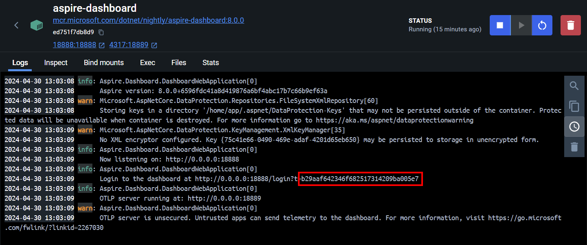

# Observability in Umbraco

This repository contains example code to demonstrate using Observability in Umbraco. To run the project, run the following commands:

## Prerequisites

To run the sample in this repository you will need to install the following:

- .NET 9 SDK
- Docker Desktop

## Running the Sample

This sample project containes a simple Umbraco Project, which uses the .NET Aspire Standalong Dashboard and OpenTelemetry to provide observability into the project.

### 1 - Run the Aspire Dashboard

The .NET Aspire Standalong can run standalong in Docker by running the following command:

**Note:** The Aspire Dashboard requires Docker to be installed on your machine. If you need a Docker runtime, you can download Docker from [here](https://www.docker.com/products/docker-desktop).

```bash
docker run --rm -it -d -p 18888:18888 -p 4317:18889 -e DOTNET_DASHBOARD_UNSECURED_ALLOW_ANONYMOUS=’true’ --name aspire-dashboard mcr.microsoft.com/dotnet/aspire-dashboard:latest
```

When the dashboard is running, you will need to examine the logs to get the URL with access token to log in to the dashboard. This should be visible in the terminal window where you ran the `docker run` command, or you can click on the container in Docker Desktop and view the logs there. 



For more information on configuring the Aspire Dashboard, see the [official documentation](https://learn.microsoft.com/en-us/dotnet/aspire/fundamentals/dashboard/standalone?tabs=bash).


### 2 - Configure OpenTelemetry

To configure OpenTelemetry, follow the steps below

**Note: This has ALREADY BEEN DONE in this repository and is provided for completeness. You DO NOT need to complete these steps to run the demo.**


#### 2.1 - Install the OpenTelemetry nuget packages

Install the OpenTelemetry nuget packages into the UmbObservability project. You can do this by running the following commands:

```bash

dotnet add UmbObservability package OpenTelemetry.Exporter.OpenTelemetryProtocol 
dotnet add UmbObservability package OpenTelemetry.Extensions.Hosting
dotnet add UmbObservability package OpenTelemetry.Instrumentation.AspNetCore
dotnet add UmbObservability package OpenTelemetry.Instrumentation.Http
dotnet add UmbObservability package OpenTelemetry.Instrumentation.Runtime

```

#### 2.2 - Configure OpenTelemetry

Add the following to your appsettings.json file at the root level:

```json
{
  // Taken from the Docker endpoint
  "OTEL_EXPORTER_OTLP_ENDPOINT": "http://localhost:4317"
}
```

Modify the program.cs file to include the following code:

```csharp

using OpenTelemetry;
using OpenTelemetry.Resources;
using OpenTelemetry.Trace;

// Configure OTLP exporter
var openTelemetryUri = new Uri(builder.Configuration["OTEL_EXPORTER_OTLP_ENDPOINT"]);

// Configure Logging
builder.Logging.AddOpenTelemetry(log =>
{
   log.AddOtlpExporter(opt => opt.Endpoint = openTelemetryUri);
   log.IncludeScopes = true;
   log.IncludeFormattedMessage = true;
});


// Configure OpenTelemetry
builder.Services.AddOpenTelemetry()
  .ConfigureResource(res => res
      .AddService(WeatherMetrics.ServiceName))
  .WithMetrics(metrics =>
  {
      metrics
          .AddHttpClientInstrumentation()
          .AddAspNetCoreInstrumentation()
          .AddRuntimeInstrumentation();

      metrics.AddMeter(WeatherMetrics.Meter.Name);

      metrics.AddOtlpExporter(opt => opt.Endpoint = openTelemetryUri);
  })
  .WithTracing(tracing =>
      {

          tracing
              .AddAspNetCoreInstrumentation()
              .AddHttpClientInstrumentation();

          tracing.AddOtlpExporter(opt => opt.Endpoint = openTelemetryUri);

      }
  );

```

### 3 - Run the Umbraco Project

In a separate terminal window from the root of the repository, run the following command to start the Umbraco project:

```bash

dotnet run --project "UmbObservability"
```

This project uses a local SQLite database, and you can run the site by visiting `https://localhost:44306/` in your browser. For the Umbraco backoffice, visit `https://localhost:44306/Umbraco` in your browser and use the following credentials:

- Username: admin@example.com
- Password: 1234567890
    

## References

- .NET Aspire Standalong Dashboard - https://learn.microsoft.com/en-us/dotnet/aspire/fundamentals/dashboard/standalone?tabs=bash
- .NET Observability with Open Telemetry - https://learn.microsoft.com/en-us/dotnet/core/diagnostics/observability-with-otel
- Open Telemetry Protocol - https://opentelemetry.io/docs/specs/otlp/
    - https://github.com/dotnet/aspire-samples/tree/main/samples/StandaloneDashboard